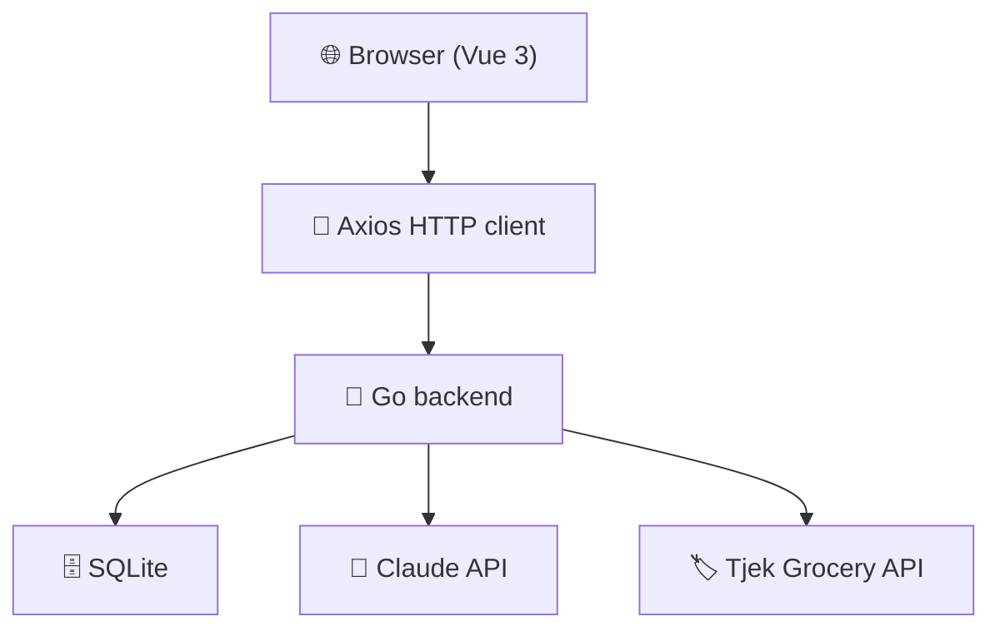

# 🍽️ Måltiden 🇸🇪

> **Din veckans middagsplanerare** — a warm, family-first meal planner that thinks ahead so you don't have to.

Plan your week, parse recipes with AI, and shop smarter — all in Swedish, all in one place.

**[→ Try the live app at maltiden.fly.dev](https://maltiden.fly.dev/)**

---

[](https://github.com/jesper-aityr/maltiden/actions/workflows/ci.yml)
[](LICENSE)
[](https://github.com/jesper-aityr/maltiden/commits/main)
[](https://maltiden.fly.dev/)
[](https://vuejs.org/)
[](https://go.dev/)

---

## ✨ Features

- 📅 **Weekly meal planning** — drag, swap, and organise dinners across the whole week
- 🤖 **AI recipe parsing** — paste any recipe text; Claude extracts ingredients and steps automatically
- 🛒 **Smart shopping list** — generated directly from your weekly menu, grouped and ready to shop
- 👨‍👩‍👧 **Household sharing** — invite family members, plan together, each with their own role
- 💰 **Tjek grocery offers** — real-time Swedish grocery discounts matched to your ingredients
- 🌙 **Dark mode** — fully implemented, warm cream-and-coral palette in both themes
- 🇸🇪 **Swedish UI** — every user-facing string in Swedish, because that's how meatballs roll

---

## 🚀 Quick Start

**1. Clone the repo**

```bash
git clone https://github.com/jesper-aityr/maltiden.git
cd maltiden
```

**2. Start the backend**

```bash
cd backend
JWT_SECRET=dev-secret-for-local-development go run cmd/server/main.go
```

**3. Start the frontend**

```bash
cd frontend
npm ci && npm run dev
```

The app will be available at `http://localhost:5173`. The backend listens on `:8080`.

> **No Claude API key?** Recipe parsing degrades gracefully — everything else works fine.

---

## 🗺️ Architecture



**Layers (strict, unidirectional):**

| Layer | Responsibility |
|-------|---------------|
| `api/handlers/` | HTTP glue — decode request, call service, encode response |
| `services/` | Business logic, validation, orchestration |
| `storage/sqlite/` | Raw SQL queries, transactions |
| `domain/` | Pure types — zero imports from other layers |

---

## 📸 Screenshots

<details>
<summary>Click to expand — app screenshots (coming soon)</summary>

| Dashboard | Recipe Parser |
|-----------|--------------|
|  |  |

| Shopping List | Dark Mode |
|---------------|-----------|
|  |  |

> Real screenshots will land here once the UI stabilises post-v1.

</details>

---

## 🛠️ Tech Stack

| Layer | Technology |
|-------|-----------|
| Frontend | Vue 3.5 + TypeScript strict, Pinia, Vite 7 |
| Backend | Go 1.26, `database/sql` + SQLite (CGO) |
| Auth | JWT (HS256, 7-day) + bcrypt cost 12 |
| AI | Claude API (`claude-sonnet-4-5`) — recipe parsing |
| Grocery data | Tjek / etilbudsavis.dk — Swedish store offers |
| Hosting | Fly.io (region: arn) |
| CI | GitHub Actions — build · test · vet · govulncheck · type-check |

---

## 💭 Why Måltiden? / Varför Måltiden?

**English:** Deciding what to eat every night is exhausting. "Måltiden" (Swedish for *the meal*) started as a weekend project to scratch that itch — a place where a household could plan the week's dinners together, paste in recipes from anywhere, and walk into the supermarket with a list that actually matches what they're cooking. It grew from a prototype into a full-stack app with AI-powered parsing, live grocery offers, and household sharing. The goal is simple: less friction between a good idea for dinner and a proper family meal on the table.

**Svenska:** Att bestämma vad man ska äta varje kväll är tröttsamt. Måltiden startade som ett helgprojekt för att lösa just det — ett ställe där ett hushåll kan planera veckans middagar tillsammans, klistra in recept från var som helst, och gå till affären med en lista som faktiskt stämmer med vad man lagar. Det växte från en prototyp till en fullstackapp med AI-driven recepttolkning, aktuella matbutiksrabatter och hushållsdelning. Målet är enkelt: mindre friktion mellan en god middagsidé och en riktig familjemåltid på bordet.

---

## 👥 Contributors

See all contributors at [github.com/jesper-aityr/maltiden/graphs/contributors](https://github.com/jesper-aityr/maltiden/graphs/contributors).

Pull requests are welcome — please open an issue first to discuss significant changes.

---

## 📄 License

MIT © Måltiden contributors
